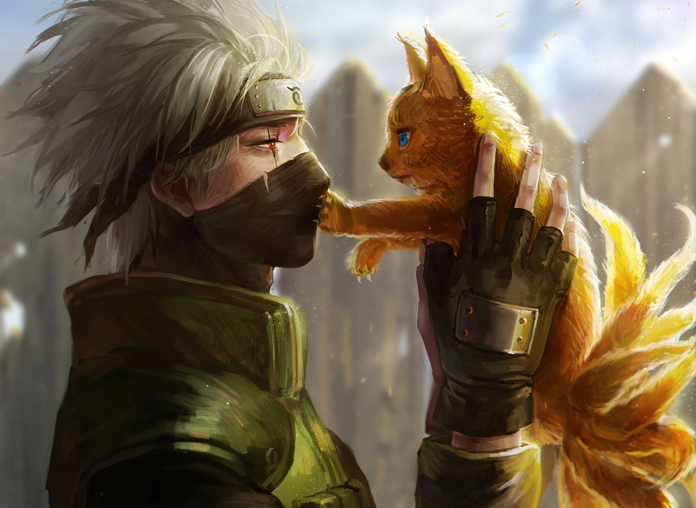

<p align="center">

</p>
<p align="center">
𝗖𝗥𝗘𝗔𝗗𝗢𝗥: GARU

### MIS CONTACTOS
<p>
<a href="http://wa.me/+529161875123" target="blank"></a>
 
</p>

### PROCESO DE INSTALACION
Instala archivos necesarios
```bash
- pkg upgrade && update
- pkg install nodejs
- pkg install git
- pkg install bash
```
Clona este repositorio
 ```bash
> git clone https://github.com/Spaguett/Nani
```
Inicia la instalacion
```bash
- cd GARU
- bash install.sh
```
PARA INICIAR EL BOT

 ```bash
- npm start
```

